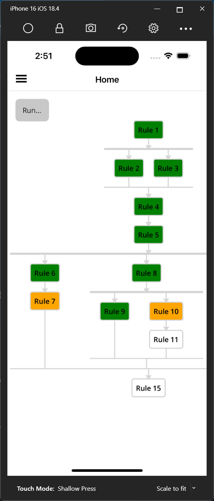
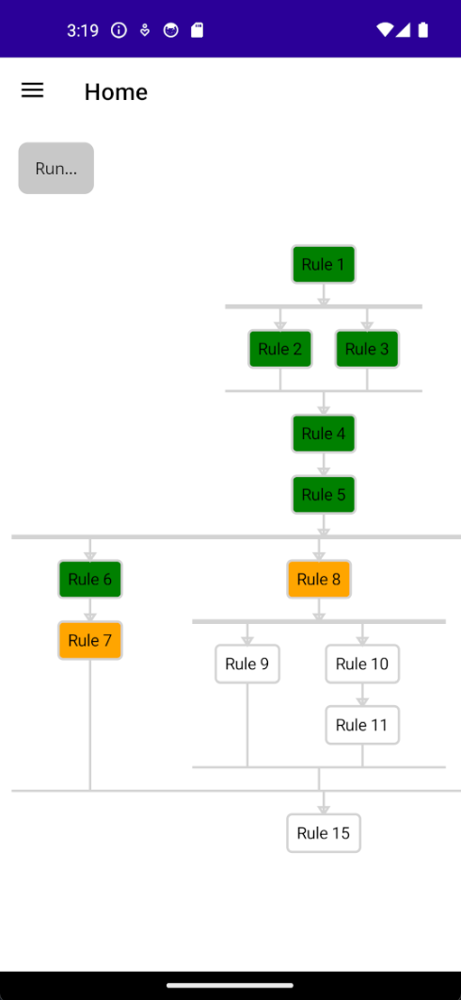
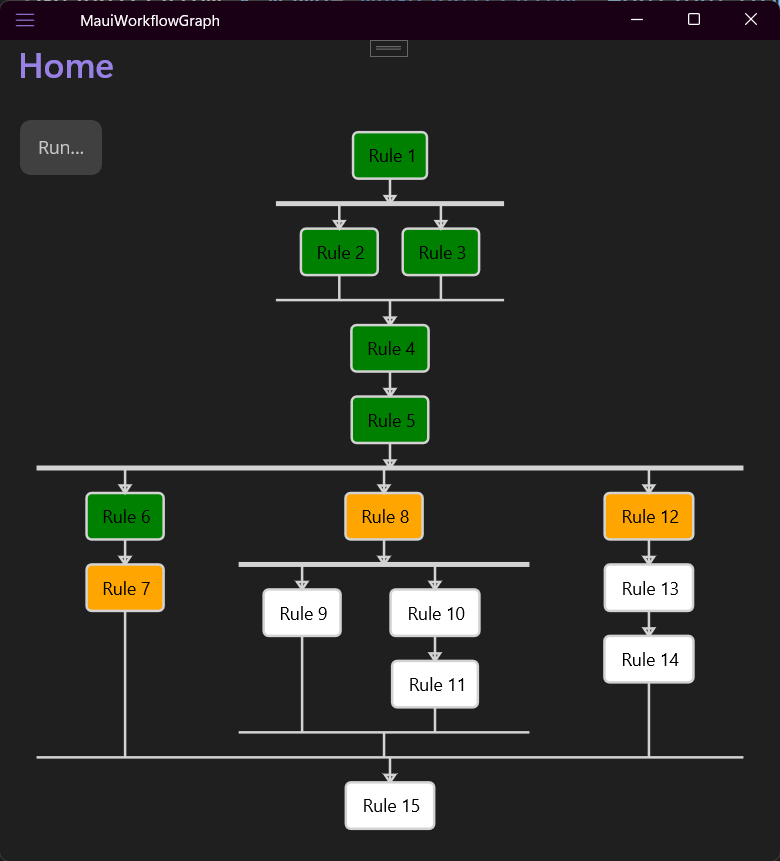
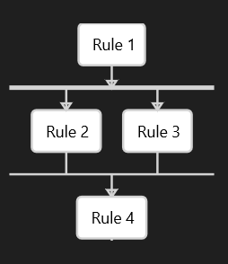
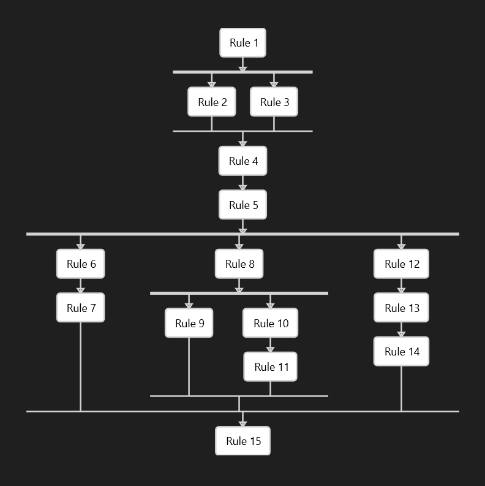

# Process Flow Demonstration
This repository contains a simple demonstration of a process flow using C# and .net MAUI. The code is designed to be easy to understand and modify a process flow that contain linear and parallel flows, making it suitable for educational purposes or as a starting point for more complex projects.

The application works on all platforms and allows selection, panning, zooming of the graph.
As well as a simulated execution.

  
 


## Features
  - 2 things are required to run the code:
    - A Dictionary<string, FlowProces> that contains the processes to run (found in **FlowProcessManager.cs**)
    - A string that contains the structure of execution of the rules/ Processes (found in **MainPage.xaml.cs**)

### Rule dictionary (FlowProcessManager.cs)
```csharp 
_flowProcesses = new Dictionary<string, FlowProcess>
{
    { "Rule1", new FlowProcess( "Rule 1", "Description for Rule 1", "Expression1", "Result1") },
    { "Rule2", new FlowProcess( "Rule 2", "Description for Rule 2", "Expression2", "Result2") },
    { "Rule3", new FlowProcess( "Rule 3", "Description for Rule 3", "Expression3", "Result3") },
    { "Rule4", new FlowProcess( "Rule 4", "Description for Rule 4", "Expression4", "Result4") },
    { "Rule5", new FlowProcess( "Rule 5", "Description for Rule 5", "Expression5", "Result5") },
    { "Rule6", new FlowProcess( "Rule 6", "Description for Rule 6", "Expression6", "Result6") },
    { "Rule7", new FlowProcess( "Rule 7", "Description for Rule 7", "Expression7", "Result7") },
    { "Rule8", new FlowProcess( "Rule 8", "Description for Rule 8", "Expression8", "Result8") },
    { "Rule9", new FlowProcess( "Rule 9", "Description for Rule 9", "Expression9", "Result9") },
    { "Rule10", new FlowProcess( "Rule 10", "Description for Rule 10", "Expression10", "Result10") },
    { "Rule11", new FlowProcess( "Rule 11", "Description for Rule 11", "Expression11", "Result11") },
    { "Rule12", new FlowProcess( "Rule 12", "Description for Rule 12", "Expression12", "Result12") },
    { "Rule13", new FlowProcess( "Rule 13", "Description for Rule 13", "Expression13", "Result13") },
    { "Rule14", new FlowProcess( "Rule 14", "Description for Rule 14", "Expression14", "Result14") },
    { "Rule15", new FlowProcess( "Rule 15", "Description for Rule 15", "Expression15", "Result15") }
};
```
### Execution structure (MainPage.xaml.cs))
```csharp
string input = "[Rule1,(Rule2,Rule3),Rule4,Rule5,([Rule6,Rule7],[Rule8,(Rule9,[Rule10,Rule11])],[Rule12,Rule13,Rule14]),Rule15]";
_renderer = new GraphRenderer();
_renderer.UpdateGraph(input);
myGraphicsView.Drawable = _renderer;
```
#### Formatting of the input string
- The input string is a nested structure that represents the execution order of the rules.
  - "[...]" inside brackets are sequences executed sequencially. 
  - "(...)" inside parenthesis are sequences executed in parallel.
  - Each rule is represented by its dictionary index (e.g., "Rule1", "Rule2", etc.).
****"[Rule1,(Rule2,Rule3),Rule4]"**** means that **Rule1** is executed first, followed by **Rule2** and **Rule3** in parallel, and then **Rule4**.
 

#### Example of a complex flow:
****"[Rule1,(Rule2,Rule3),Rule4,Rule5,([Rule6,Rule7],[Rule8,(Rule9,[Rule10,Rule11])],[Rule12,Rule13,Rule14]),Rule15]"****.
 

