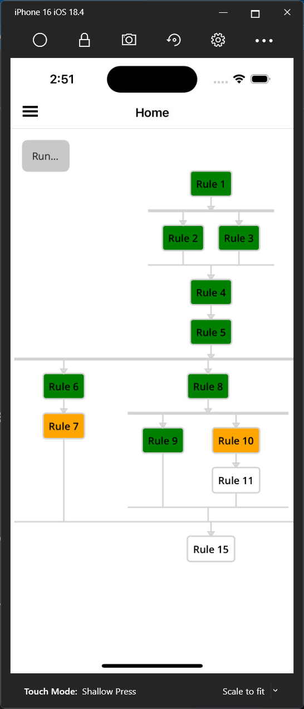
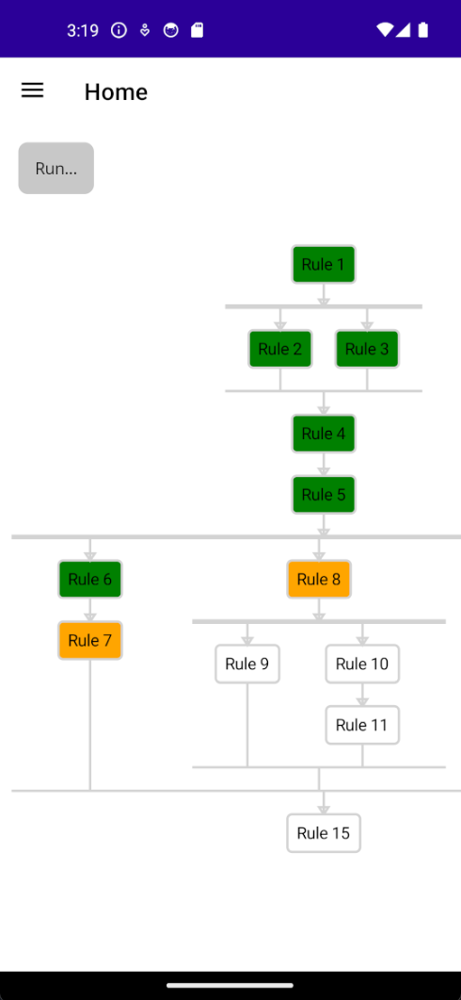
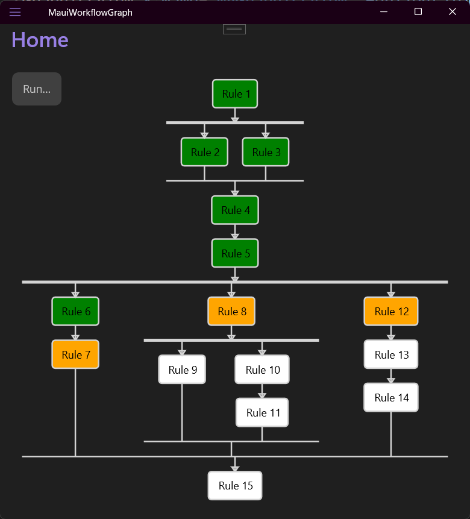
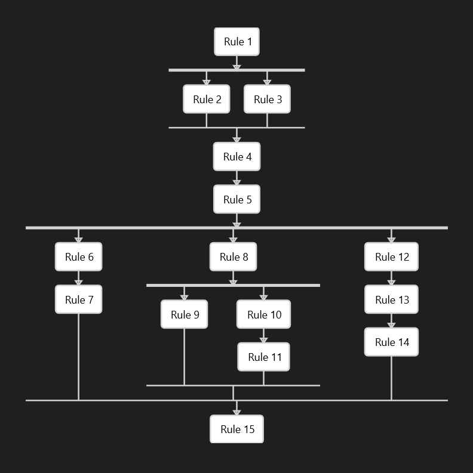

# Process Flow Demonstration
This repository contains a simple demonstration of a process flow using C# and .net MAUI. The code is designed to be easy to understand and modify a process flow that contain linear and parallel flows, making it suitable for educational purposes or as a starting point for more complex projects.

The application works on all platforms and allows selection, panning, zooming of the graph.
As well as a simulated execution.

  
 


## Features
  - 2 things are required to run the code:
    - A Dictionary<string, FlowProces> that contains the processes to run (found in **FlowProcessManager.cs**)
    - A string that contains the structure of execution of the rules/ Processes (found in **MainPage.xaml.cs**)

### Rule dictionary (FlowProcessManager.cs)
```csharp 
 _flowProcesses = new Dictionary<string, FlowProcess>
 {
     { "Rule1", new FlowProcess( "Rule 1", "Description for Rule 1", "x => x + 1", "Result1") },
     { "Rule2", new FlowProcess( "Rule 2", "Description for Rule 2", "(a, b) => a * b", "Result2") },
     { "Rule3", new FlowProcess( "Rule 3", "Description for Rule 3", "(customer, order) => customer.Amount > 100", "Result3") },
     { "Rule4", new FlowProcess( "Rule 4", "Description for Rule 4", "(a, b, userId) => a * b + userId.Length", "Result4") },
     { "Rule5", new FlowProcess( "Rule 5", "Description for Rule 5", "(x) => { return x + 1; }", "Result5") },
     { "Rule6", new FlowProcess( "Rule 6", "Description for Rule 6", "(a, b) => a * b", "Result6") },
     { "Rule7", new FlowProcess( "Rule 7", "Description for Rule 7", "x => x + 1", "Result7") },
     { "Rule8", new FlowProcess( "Rule 8", "Description for Rule 8", "(a, b, userId) => a * b + userId.Length", "Result8") },
     { "Rule9", new FlowProcess( "Rule 9", "Description for Rule 9", "(a, b) => a * b", "Result9") },
     { "Rule10", new FlowProcess( "Rule 10", "Description for Rule 10", "(x,y,z)=> x+y+z", "Result10") },
     { "Rule11", new FlowProcess( "Rule 11", "Description for Rule 11", "(a, b) => a * b", "Result11") },
     { "Rule12", new FlowProcess( "Rule 12", "Description for Rule 12", "(a, b, userId) => a * b + userId.Length", "Result12") },
     { "Rule13", new FlowProcess( "Rule 13", "Description for Rule 13", "   (customer, order) => customer.Amount > 100", "Result13") },
     { "Rule14", new FlowProcess( "Rule 14", "Description for Rule 14", "x => x + 1", "Result14") },
     { "Rule15", new FlowProcess( "Rule 15", "Description for Rule 15", "(x,y,z)=> x+y+z", "Result15") }
 };
 ```
 
#### Example of a complex flow:
****"[Rule1,(Rule2,Rule3),Rule4,Rule5,([Rule6,Rule7],[Rule8,(Rule9,[Rule10,Rule11])],[Rule12,Rule13,Rule14]),Rule15]"****.
 

## New Features:
- **Editing Panel:** (Added - 6/13/25) the editing panel allows you to edit the rules and the execution structure. The changes are reflected in the graph immediately after saving and validating. 

https://github.com/user-attachments/assets/8c72dae7-0419-4574-939a-b456c1d15a96

- **Editing the rules:** you can edit the name, description, Lambda expression, and result of each rule. The changes are saved in the dictionary and reflected in the graph immediately.
